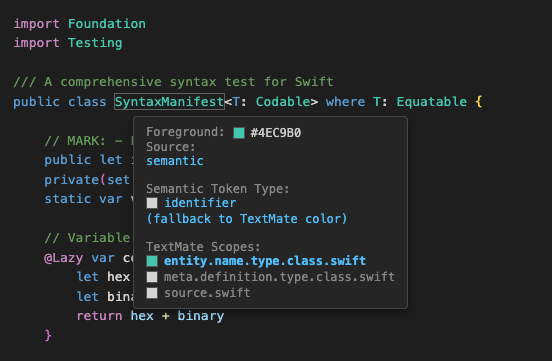
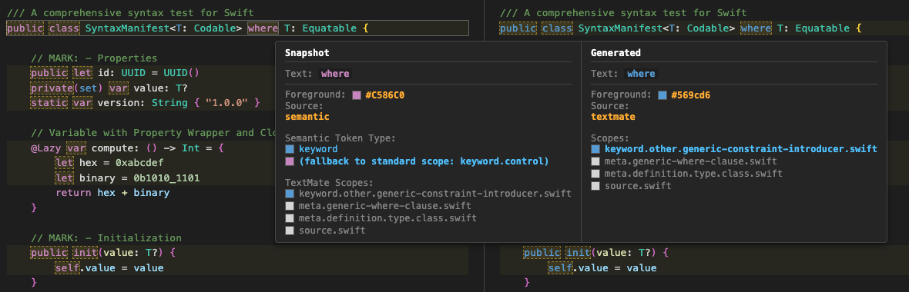

# VSCode Syntax Highlighting Tester

<sup>Built mostly by Gemini 3 Pro using [opencode](https://opencode.ai).</sup>

A CLI tool to validate VSCode syntax highlighting by combining TextMate grammars and LSP Semantic Tokens, ensuring your editor themes and grammars work as expected.

## Features

- **Hybrid Engine**: Simulates VS Code's highlighting pipeline by merging TextMate scopes (using `vscode-textmate` + `vscode-oniguruma`) with LSP Semantic Tokens.
- **Theme Support**: Resolves colors using VS Code compatible JSON themes.
- **Visualization**: Generates HTML previews with tooltips to inspect the full scope stack and token provenance (TextMate vs Semantic).



- **Regression Testing**: Snapshot-based testing to verify that changes to the semantic tokens, grammar, or theme do not introduce unexpected differences.
- **Diffing**: When verifying snapshots, generates a diff of any mismatches to quickly identify issues.



## Installation

```bash
bun install
```

## Usage

Run the tool with a configuration file:

```bash
bun run src/index.ts config.json
```

### Configuration (`config.json`)

The configuration file controls which grammar, LSP, and files are tested. Paths in the config are generally relative to the location of the `config.json` file itself.

```json
{
  "grammar": "./path/to/grammar.tmLanguage.json",
  "scopeName": "source.swift",
  "lsp": {
    "command": ["/path/to/language-server", "--arg1", "--arg2"],
    "rootUri": "file:///path/to/project"
  },
  "theme": "./path/to/theme.json", 
  "files": ["./path/to/source1", "./path/to/source2"],
  "outDir": "./results",
  "snapshotDir": "./snapshots"
}
```

| Property | Type | Required | Description | Default |
|----------|------|----------|-------------|---------|
| `grammar` | `string` | **Yes** | Path to the main TextMate grammar file (JSON format). | - |
| `scopeName` | `string` | **Yes** | The root scope name of the grammar (e.g., `source.ts`, `source.swift`). | - |
| `theme` | `string` | **Yes** | Path to a VS Code compatible JSON theme file. Supports `include` inheritance. | - |
| `files` | `string[]` | **Yes** | List of source files to process and highlight. | - |
| `lsp.command` | `string[]` | **Yes** | The command to launch the Language Server (e.g., `["node", "server.js"]` or `["/path/to/binary"]`). | - |
| `lsp.rootUri` | `string` | No | The root URI sent to the LSP `initialize` request. | `file://` + directory of `config.json` |
| `extraGrammars` | `object` | No | A map of scope names to grammar paths. Used for including other languages (e.g., embedding SQL in Strings). | `{}` |
| `outDir` | `string` | No | Directory where HTML and JSON results are written. | `./out` (relative to `config.json`) |
| `snapshotDir` | `string` | No | Directory where expected token snapshots are stored for verification. | `./snapshots` (relative to `config.json`) |

### Snapshot Testing

To verify that the current output matches previously saved snapshots:

```bash
bun run src/index.ts config.json --verify
```

To update snapshots (accept current output as correct):

```bash
bun run src/index.ts config.json --update
```

When running in `--verify` mode, if there are any mismatches between the generated tokens and the snapshot, a visual diff report will be generated for each file, showing side-by-side comparisons of the expected vs actual tokens.

### Visual Diff Tool

You can manually generate a visual diff HTML report between any two token JSON files (e.g., a snapshot and a newly generated output) using the `diff` command.

```bash
bun run src/index.ts diff <snapshot.json> <generated.json> [output.html]
```

- `snapshot.json`: The "expected" token file (left side of diff).
- `generated.json`: The "actual" token file (right side of diff).
- `output.html`: (Optional) The output path for the HTML report. Defaults to `diff.html`.

This generates an interactive side-by-side view where you can verify discrepancies in color, style, or scopes.

### Example workflow for testing changes to a grammar or language server:

1. Set up a config pointing to your grammar, LSP, and test files.
2. Run the tool with `--update` to generate a baseline snapshot.
3. Make changes to your grammar or language server.
4. Run the tool with `--verify` to get a report of any differences from the baseline.

## Output

For each input file, the tool generates:

1. `filename.html`: An interactive preview of the highlighting. Hover over tokens to see scope details.
2. `filename.tokens.json`: A raw JSON dump of the resolved tokens (used for snapshots).

## License

MIT License. See [LICENSE](LICENSE) for details.
